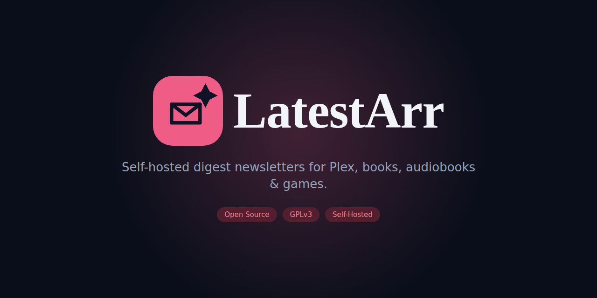

# LatestArr

[](https://github.com/jshields-ca/latestarr/releases)
[](https://github.com/jshields-ca/latestarr/actions/workflows/ci.yml)
[](LICENSE)



**LatestArr** is a self-hosted, open-source "new content" newsletter tool for the self-hosted media ecosystem — the *arr stack and friends. It connects to your existing media servers, pulls in whatever movies, TV episodes, books, audiobooks, and games were recently added, and sends a fully custom-branded HTML digest to your users on a schedule you control.

It exists because [Tautulli](https://tautulli.com/)'s built-in newsletter feature — the closest existing tool to this — only speaks to Plex and offers limited control over layout, scheduling, and branding. LatestArr is a standalone tool, Plex-aware but not Plex-only, built around a drag-and-drop template editor so anyone can design their own newsletter without touching HTML or CSS.

> **Status (v0.3.0):** the backend engine, admin WebUI, drag-and-drop template builder, and first-run onboarding are all complete and wired end-to-end — connect sources, manage recipients/SMTP/newsletters, design templates visually, and send on schedule, all from the browser. All planned v1 source adapters (Tautulli, direct Plex, BookLore-family, Audiobookshelf, RomM) are implemented. Currently in the hardening & polish phase ahead of `1.0`: security headers/rate limiting/CSRF, zod input validation, missed-schedule catch-up, and an accessibility pass are done; deliverability docs are done (see [`docs/deliverability.md`](docs/deliverability.md)); scale options (optional Postgres/Redis) remain (see [Roadmap](#roadmap)). See [`CHANGELOG.md`](CHANGELOG.md) for what shipped in each release.

## Why LatestArr?

- **Source-agnostic** — connect Plex/Tautulli, book libraries, audiobook servers, and game libraries, and mix them into one newsletter or split them across many.
- **No-code, drag-and-drop templates** — build your own layout from blocks (movie cards, book cards, headers, footers, ...) with full control over branding, CSS/HTML, and dynamic subject lines, no coding required.
- **Flexible scheduling** — every newsletter has its own schedule, lookback window, sources, and recipient list.
- **Built for public exposure** — OIDC/SSO support, encrypted-at-rest credentials, and secure-by-default hardening, because self-hosted tools increasingly get exposed to the internet.
- **Accessible by default** — the admin UI is built on accessible-first components and tested against automated accessibility checks in CI, not bolted on after the fact.
- **Open source, GPLv3** — built to be forked, extended, and contributed to.

## Supported sources

| Source | Content type | Status |
| --- | --- | --- |
| [Tautulli](https://tautulli.com/) | Movies, TV | ✅ Implemented |
| Plex (direct) | Movies, TV | ✅ Implemented |
| [BookLore](https://github.com/booklore-app/booklore) | Books | ✅ Implemented |
| [BookOrbit](https://github.com/bookorbit/bookorbit) | Books | ✅ Implemented |
| [Grimmory](https://github.com/grimmory-tools/grimmory) | Books | ✅ Implemented |
| [Audiobookshelf](https://www.audiobookshelf.org/) | Audiobooks | ✅ Implemented |
| [RomM](https://github.com/rommapp/romm) | Games | ✅ Implemented |
| Kavita, Komga, Calibre-Web, Jellyfin/Emby, Immich, ... | Various | Under consideration, post-v1 |

New sources are added via a self-contained adapter interface — see [`CONTRIBUTING.md`](CONTRIBUTING.md) if you'd like to add support for something not listed here.

## Roadmap

Development is happening in phases. Versions follow [semver](https://semver.org/) starting at `0.1.0`; see [`CHANGELOG.md`](CHANGELOG.md) for release notes.

1. ✅ **Repo hygiene & scaffolding** — docs, CI, monorepo skeleton. *(v0.1.0)*
2. ✅ **Auth + data model + first adapter** — local/OIDC auth, core schema, Tautulli integration end-to-end. *(v0.1.0)*
3. ✅ **Scheduler + email delivery MVP** — automated digest sends with a fixed starter template. *(v0.1.0)*
4. ✅ **Frontend WebUI + drag-and-drop template builder** — the full admin UI (Tailwind + Radix + Lucide, dark-mode-first, mobile-responsive), the no-code visual editor, and the "Bloom" brand refresh. *(v0.2.0)*
5. ✅ **Remaining v1 adapters** — direct Plex, BookLore-family, Audiobookshelf, RomM. *(v0.2.0)*
6. ✅ **Onboarding & first-run experience** — a docker-compose quick start, a real dashboard with a setup checklist and recent-send activity, and guided empty states across the admin screens, so a new self-hoster can go from a fresh install to a first sent newsletter without reading source code. *(v0.3.0)*
7. 🚧 **Hardening & polish** *(current)* — security headers, rate limiting, and CSRF protection; zod input validation on every route; missed-schedule catch-up for the scheduler; an accessibility pass (keyboard-operable template builder, a WCAG AA contrast audit); self-hosting and deliverability docs. Scale options (optional Postgres/Redis) remain before `1.0`.

### Releasing

Releases are fully automated with [Changesets](https://github.com/changesets/changesets): a merged PR with a pending changeset queues a "Version Packages" PR, and merging that cuts a tagged GitHub Release with consolidated notes — no manual version bumps or tagging. See [`CONTRIBUTING.md`](CONTRIBUTING.md#versioning--releases) for the full mechanics, including how to add a changeset to your own PR.

## Getting started

The backend and admin WebUI both run from a single container.

```bash
cp .env.example .env
# Generate a value for ENCRYPTION_KEY in .env: openssl rand -base64 32
docker compose up -d
```

Then visit `http://localhost:3000`, create the admin account, and the dashboard's setup checklist walks you through connecting a source, adding recipients, configuring SMTP, and creating your first newsletter — no separate wizard, just the admin screens themselves in a sensible order.

See [`.env.example`](.env.example) for every supported environment variable, [`docs/self-hosting.md`](docs/self-hosting.md) for the full walkthrough (reverse proxy setup, OIDC/SSO, backups, upgrades), and [`docs/deliverability.md`](docs/deliverability.md) for why digest emails land in spam without SPF/DKIM/DMARC and how to set them up.

## Contributing

Contributions are welcome — see [`CONTRIBUTING.md`](CONTRIBUTING.md) for how to set up a dev environment, coding standards, and how to add a new source adapter. Please also read our [`CODE_OF_CONDUCT.md`](CODE_OF_CONDUCT.md).

Found a security issue? Please follow the process in [`SECURITY.md`](SECURITY.md) rather than opening a public issue.

## License

LatestArr is licensed under the [GNU General Public License v3.0](LICENSE). This is a copyleft license: if you distribute a modified version of LatestArr (including as a fork or a hosted service that distributes the code), your version must also be licensed under GPLv3 and its source made available. Third-party dependencies under permissive licenses (e.g. MIT) are used as libraries and do not change this obligation for LatestArr's own code.
