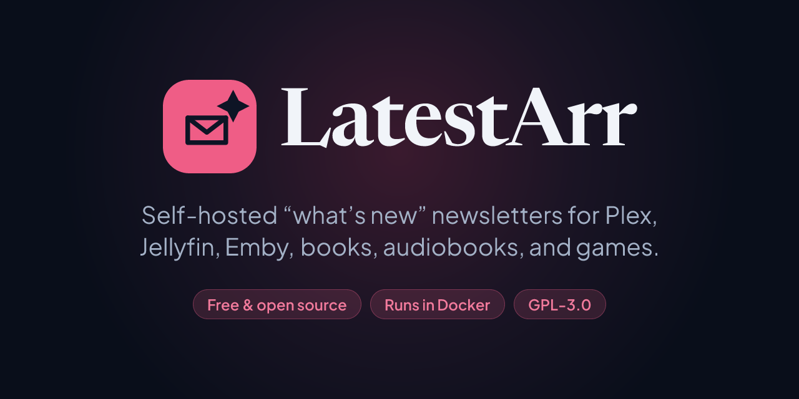

# LatestArr

[](https://github.com/jshields-ca/latestarr/releases)
[](https://github.com/jshields-ca/latestarr/actions/workflows/ci.yml)
[](LICENSE)
[](https://github.com/sponsors/jshields-ca)



> **⚠️ Active testing and iteration.** LatestArr is pre-1.0 and changing fast — expect bugs, rough edges, and breaking changes between releases. It's usable today, but if you're testing it, back up your data first and don't treat it as a finished product yet. See [`CHANGELOG.md`](CHANGELOG.md) for what's changed recently and the [Issues](https://github.com/jshields-ca/latestarr/issues) page for known gaps.

**LatestArr** is a self-hosted, open-source "new content" newsletter tool for the self-hosted media ecosystem — the *arr stack and friends. It connects to your existing media servers, pulls in whatever movies, TV episodes, books, audiobooks, and games were recently added, and sends a fully custom-branded HTML digest to your users on a schedule you control.

It exists because [Tautulli](https://tautulli.com/)'s built-in newsletter, the closest existing tool, only speaks to Plex and offers limited control over layout, scheduling, and branding. LatestArr is Plex-aware but not Plex-only, and its design editor lets anyone style a newsletter with a live preview and no HTML or CSS, with a code mode for full control.

The goal is simple: give something genuinely useful back to the *arr community.

## Why LatestArr?

- **Source-agnostic** — connect Plex, Tautulli, Jellyfin, Emby, book libraries, audiobook servers, and game libraries, and mix them into one newsletter or split them across many.
- **Designs with a live preview** — pick colours, font, and layout (cards, compact list, or grid), choose which details each item shows, group items by type, and add your own intro, footer, and buttons, all without code. Or switch a design to **code mode** and edit its MJML directly, with the same live preview.
- **Flexible scheduling** — every newsletter has its own schedule, lookback window, sources, and recipient list, with automatic catch-up if the server was down when a send was due.
- **Built for public exposure** — OIDC/SSO support, encrypted-at-rest credentials, security headers, rate limiting, CSRF protection, and input validation on every route, because self-hosted tools increasingly get exposed to the internet.
- **Accessible by default** — the admin UI is built on accessible-first components, tested against automated accessibility checks in CI, and manually verified keyboard-only, not bolted on after the fact.
- **Open source, GPLv3** — built to be forked, extended, and contributed to.

## How it works

1. **Connect a source** — any of the [supported sources](#supported-sources) below. LatestArr asks it for recently added items each time a newsletter is built.
2. **Pick a design** (optional) — duplicate the built-in Default under Designs and adjust it with a live preview, or skip this and use Default as is.
3. **Set up recipients and SMTP** — group your recipients, connect an SMTP server to send from.
4. **Create a newsletter** — pick a schedule, a lookback window, which sources feed it, and who receives it. It sends itself from there.

## Supported sources

| Source | Content type | Connects via | Status |
| --- | --- | --- | --- |
| [Tautulli](https://tautulli.com/) | Movies, TV | Tautulli API | ✅ Implemented |
| Plex (direct) | Movies, TV | Plex API | 🧪 [Needs testers](https://github.com/jshields-ca/LatestArr/issues/244) |
| [Jellyfin](https://jellyfin.org/) | Movies, TV, books, audiobooks | Jellyfin API | 🧪 [Needs testers](https://github.com/jshields-ca/LatestArr/issues/196) |
| [Emby](https://emby.media/) | Movies, TV, books, audiobooks | Emby API | 🧪 [Needs testers](https://github.com/jshields-ca/LatestArr/issues/196) |
| [BookLore](https://github.com/booklore-app/booklore) | Books | OPDS | 🧪 [Needs testers](https://github.com/jshields-ca/LatestArr/issues/244) |
| [BookOrbit](https://github.com/bookorbit/bookorbit) | Books | OPDS | ✅ Implemented |
| [Grimmory](https://github.com/grimmory-tools/grimmory) | Books | OPDS | 🧪 [Needs testers](https://github.com/jshields-ca/LatestArr/issues/244) |
| [Audiobookshelf](https://www.audiobookshelf.org/) | Audiobooks | Audiobookshelf API | 🧪 [Needs testers](https://github.com/jshields-ca/LatestArr/issues/244) |
| [RomM](https://github.com/rommapp/romm) | Games | RomM API | ✅ Implemented |
| Kavita, Komga, Calibre-Web, Immich, ... | Various | — | Under consideration |

> **Help test the 🧪 sources.** They're built from each app's published API and covered by tests, but haven't been confirmed on a real server yet. If you run one, add it as a source, send yourself a test newsletter, and tell us how it went: [Jellyfin and Emby](https://github.com/jshields-ca/LatestArr/issues/196), or [Plex (direct), BookLore, Grimmory, and Audiobookshelf](https://github.com/jshields-ca/LatestArr/issues/244). Include your server version, what worked, and any errors from the **Logs** page. Each moves to ✅ once someone confirms it works.

BookLore, BookOrbit, and Grimmory are separate apps (forks of a common lineage) that all expose the same [OPDS](https://opds.io/) catalog protocol, so LatestArr talks to all three through one shared adapter rather than three separate integrations.

New sources are added via a self-contained adapter interface — see [`CONTRIBUTING.md`](CONTRIBUTING.md) if you'd like to add support for something not listed here.

## Getting started

The backend and admin WebUI both run from a single container.

```bash
cp .env.example .env
# Generate a value for ENCRYPTION_KEY in .env: openssl rand -base64 32
docker compose pull   # fetch the published image — skip this to build from source instead
docker compose up -d
```

Then visit `http://localhost:3000`, create the admin account, and follow the dashboard's setup checklist: connect a source, add recipients, configure SMTP, and create your first newsletter.

See [`.env.example`](.env.example) for every supported environment variable, [`docs/self-hosting.md`](docs/self-hosting.md) for the full walkthrough (reverse proxy setup, OIDC/SSO, backups, upgrades), and [`docs/deliverability.md`](docs/deliverability.md) for why digest emails land in spam without SPF/DKIM/DMARC and how to set them up.

## How it's built

AI is LatestArr's lead developer: the code, tests, CI, and docs are written by [Claude Code](https://claude.com/claude-code), Anthropic's AI coding agent. A human maintainer directs the work, reviews every change before it merges, and tests releases on a real setup. That's worth knowing before you self-host a tool that holds credentials and may face the internet.

What keeps it honest:

- **Automated checks on every change:** lint, typecheck, build, and tests (including axe-core accessibility checks) on two Node versions, plus a Docker build, all required to pass in CI.
- **Real-world testing:** UI changes are checked in a real browser, and releases are run against the maintainer's own media servers. Where that isn't possible, the sources table above marks it 🧪 Needs testers.
- **Security by design:** credentials encrypted at rest, server-side sessions, rate limiting, CSRF protection, and input validation on every route. Dependabot and CodeQL run continuously. See [`SECURITY.md`](SECURITY.md).

None of this makes it bug-free. Treat AI authorship as a reason to read the code before trusting it with sensitive data, the same care you'd give any early-stage open-source project.

## Help wanted

Outside eyes make this better, and all of these are welcome:

- **Code review**, especially anything touching security, credentials, or email handling.
- **Testing sources that haven't been confirmed yet** (marked 🧪 in [Supported sources](#supported-sources)), or any source on a setup different from ours.
- **Guidance** on making LatestArr more reliable, secure, and mature: what's missing, what's wrong, what you'd expect from a tool like this.

[Open an issue](https://github.com/jshields-ca/latestarr/issues/new/choose) to share findings or ideas. To contribute code, see [`CONTRIBUTING.md`](CONTRIBUTING.md) for the dev setup, standards, and how to add a source adapter, and please read the [`CODE_OF_CONDUCT.md`](CODE_OF_CONDUCT.md). Found a security issue? Follow [`SECURITY.md`](SECURITY.md) rather than opening a public issue.

If you'd like to support development, [GitHub Sponsors](https://github.com/sponsors/jshields-ca) is open, and a star on the repo helps too.

## License

LatestArr is licensed under the [GNU General Public License v3.0](LICENSE). This is a copyleft license: if you distribute a modified version of LatestArr (including as a fork or a hosted service that distributes the code), your version must also be licensed under GPLv3 and its source made available. Third-party dependencies under permissive licenses (e.g. MIT) are used as libraries and do not change this obligation for LatestArr's own code.

The Sources page's service logos (Tautulli, Plex, Jellyfin, Emby, BookLore, BookOrbit, Grimmory, Audiobookshelf, RomM) are bundled from [selfh.st/icons](https://selfh.st/icons) under [CC BY 4.0](https://github.com/selfhst/icons/blob/main/LICENSE) — see [`apps/web/src/assets/logos/NOTICE.md`](apps/web/src/assets/logos/NOTICE.md) for per-file attribution. Each logo is also a trademark of its respective project, used here only to identify that source, not to imply endorsement.

---

Built by [Jeremy Shields](https://www.scootr.ca) — see more projects at [scootr.ca](https://www.scootr.ca/projects).
